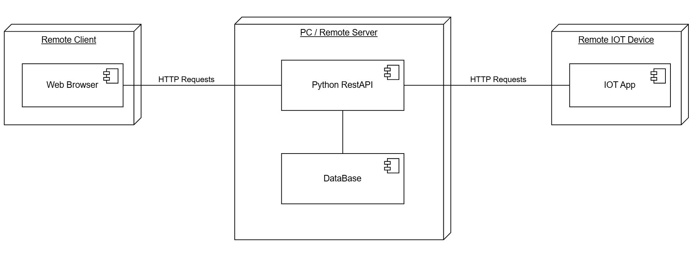
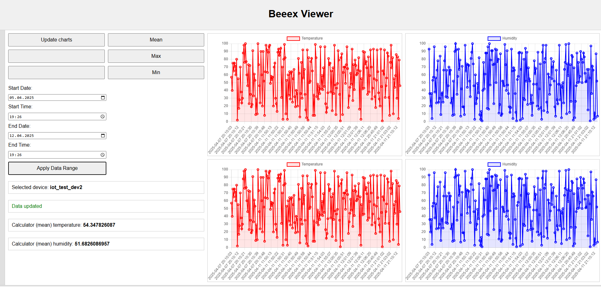
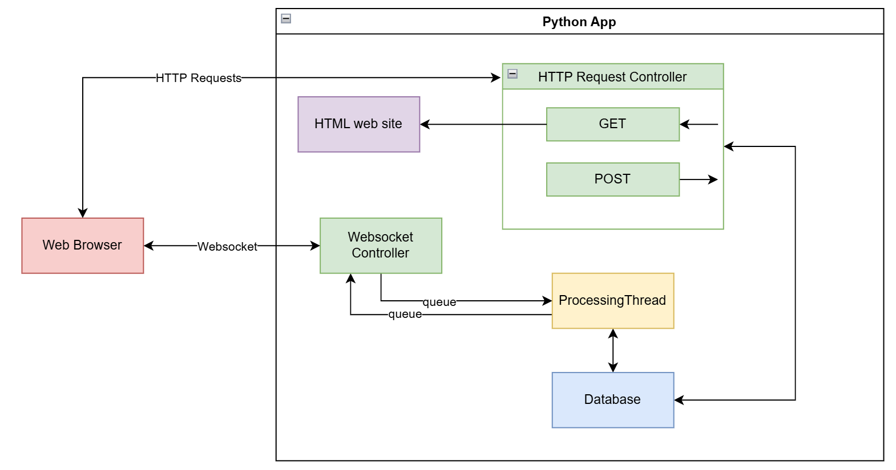
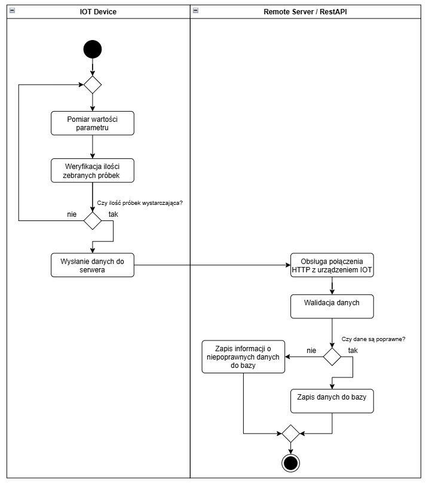
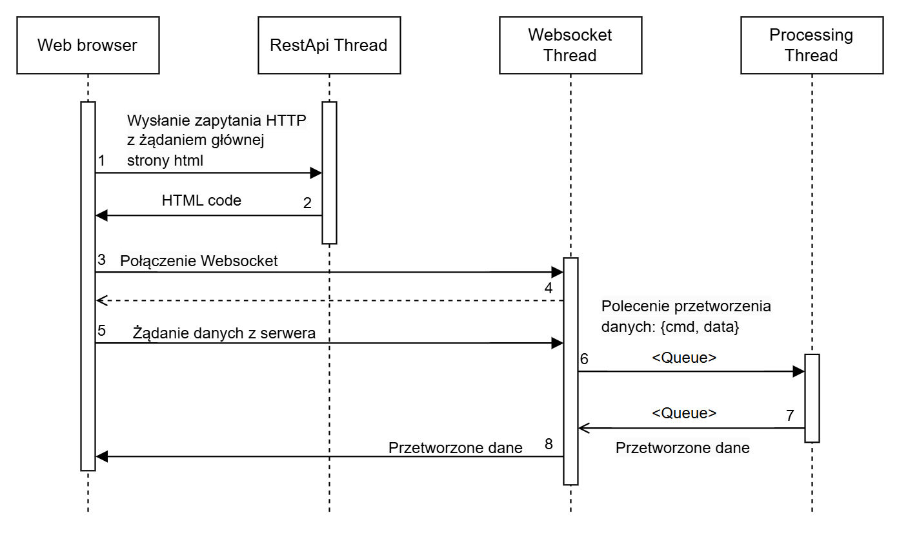

# BeeexAPI

BeeexAPI to aplikacja IoT umożliwiająca zbieranie, przetwarzanie i wizualizację danych z urządzeń IoT. Projekt składa się z serwera, klienta, bazy danych oraz interfejsu użytkownika.

## Struktura projektu

- **`logger.py`**: Moduł odpowiedzialny za logowanie zdarzeń w aplikacji.
- **`iot_tester.py`**: Klient testowy do generowania i wysyłania danych do serwera.
- **`db_test.py`**: Skrypt testujący integrację z bazą danych InfluxDB.
- **`helpers.py`**: Zbiór funkcji pomocniczych do walidacji i przygotowywania wiadomości.
- **`database.py`**: Moduł obsługujący zapis i odczyt danych z bazy InfluxDB.
- **`index.html`**: Interfejs użytkownika do wizualizacji danych.
- **`server.py`**: Serwer Flask obsługujący HTTP i WebSocket.
- **`.gitignore`**: Plik ignorujący niepotrzebne pliki w repozytorium.

---

## Architektura systemu



---

## Jak działa aplikacja?

### 1. **Logger**
Moduł `logger.py` obsługuje logowanie zdarzeń na różnych poziomach (`DEBUG`, `INFO`, `WARNING`, `ERROR`). Logi są kolorowane w konsoli dla lepszej czytelności.

### 2. **Serwer**
Serwer Flask (`server.py`) obsługuje:
- **HTTP**:
  - Endpoint `/` serwuje interfejs użytkownika (`index.html`).
  - Endpoint `/<device>/save_data` przyjmuje dane w formacie JSON i zapisuje je w bazie danych.
- **WebSocket**:
  - Obsługuje komunikację w czasie rzeczywistym z interfejsem użytkownika.
  - Przetwarza akcje takie jak `get_data`, `get_mean`, `get_max`, `get_min`.

### 3. **Baza danych**
Moduł `database.py` integruje aplikację z bazą InfluxDB. Obsługuje:
- Zapis danych pomiarowych.
- Odczyt danych w określonym zakresie czasowym.
- Obliczanie wartości średnich, maksymalnych i minimalnych.

### 4. **Interfejs użytkownika**



Plik `index.html` zapewnia wizualizację danych:
- Wykresy temperatury i wilgotności.
- Możliwość wyboru urządzenia i zakresu czasowego.
- Obsługa akcji takich jak `get_mean`, `get_max`, `get_min`.

### 5. **Klient testowy**
Skrypt `iot_tester.py` symuluje urządzenie IoT:
- Generuje dane pomiarowe.
- Wysyła je do serwera za pomocą HTTP.
- Obsługuje skrót klawiaturowy `Ctrl+W` do wysyłania danych.

---

## Jak działa WebSocket i `processing_thread`?



### WebSocket
1. Połączenie WebSocket jest inicjowane przez przeglądarkę, łącząc się z endpointem `/ws`.
2. Każde połączenie WebSocket otrzymuje unikalny identyfikator (`ws_id`), a dla niego tworzone są dwie kolejki:
   - **`in`**: Kolejka na wiadomości przychodzące od klienta.
   - **`out`**: Kolejka na wiadomości wychodzące do klienta.
3. Wiadomości od klienta są walidowane i dodawane do kolejki `in`.
4. Jeśli w kolejce `out` znajdują się odpowiedzi, są one wysyłane do klienta.

### `processing_thread`
1. Wątek `processing_thread` działa w tle i przetwarza wiadomości z kolejek `in` dla każdego połączenia WebSocket.
2. Dla każdej wiadomości:
   - Odczytywane są dane, takie jak urządzenie, zakres czasowy i akcja (`get_data`, `get_mean`, `get_max`, `get_min`).
   - Na podstawie akcji wykonywane są odpowiednie operacje na bazie danych (np. odczyt danych, obliczenie średniej).
   - Wynik jest pakowany w odpowiedź i dodawany do kolejki `out`.
3. Wątek działa w pętli, przetwarzając wiadomości co 0.1 sekundy.

---

## Przykładowe funkcjonalności

<br>



1. **Zapis danych**:
   - Endpoint: `POST /<device>/save_data`
   - Opis: Umożliwia zapis danych pomiarowych z urządzenia IoT do bazy danych.
   - Przykładowe dane:
     ```json
     {
       "point1": {
         "timestamp": "20250322214700",
         "temperature": 25,
         "humidity": 50
       },
       "point2": {
         "timestamp": "20250322214800",
         "temperature": 26,
         "humidity": 55
       }
     }
     ```
   - Odpowiedź serwera:
     - `200 OK` w przypadku sukcesu.
     - `404 Not Found` w przypadku błędów, np. nieprawidłowego urządzenia lub formatu danych.

<br>



2. **Odczyt danych**:
   - Akcja WebSocket: `get_data`
   - Opis: Pobiera dane pomiarowe z bazy danych dla wybranego urządzenia i zakresu czasowego.
   - Przykładowa wiadomość wysyłana do serwera:
     ```json
     {
       "action": "get_data",
       "data": {
         "device": "iot_test_dev1",
         "dataRange": {
           "start": {
             "date": "2023-03-01",
             "time": "00:00"
           },
           "end": {
             "date": "2023-03-07",
             "time": "23:59"
           }
         }
       }
     }
     ```
   - Przykładowa odpowiedź serwera:
     ```json
     {
       "action": "get_data",
       "data": {
         "device": "iot_test_dev1",
         "payload": [
           {
             "timestamp": "20230301000000",
             "temperature": 25,
             "humidity": 50
           },
           {
             "timestamp": "20230301010000",
             "temperature": 26,
             "humidity": 55
           }
         ]
       }
     }
     ```

3. **Obliczenia (średnia, maksymalna, minimalna wartość)**:
   - Akcje WebSocket: `get_mean`, `get_max`, `get_min`
   - Opis: Oblicza odpowiednio średnią, maksymalną lub minimalną wartość parametrów (np. temperatury, wilgotności) w wybranym zakresie czasowym.
   - Przykładowa wiadomość wysyłana do serwera:
     ```json
     {
       "action": "get_mean",
       "data": {
         "device": "iot_test_dev1",
         "dataRange": {
           "start": {
             "date": "2023-03-01",
             "time": "00:00"
           },
           "end": {
             "date": "2023-03-07",
             "time": "23:59"
           }
         }
       }
     }
     ```
   - Przykładowa odpowiedź serwera:
     ```json
     {
       "action": "get_mean",
       "data": {
         "device": "iot_test_dev1",
         "payload": {
           "temperature": 25.5,
           "humidity": 52.5
         }
       }
     }
     ```

4. **Obsługa błędów**:
   - Jeśli wiadomość wysłana do serwera jest nieprawidłowa (np. brak kluczowych pól), serwer zwraca odpowiedź z akcją `error`.
   - Przykładowa odpowiedź serwera:
     ```json
     {
       "action": "error",
       "data": {
         "message": "Missing 'device' key in data"
       }
     }
     ```

---

## Jak uruchomić?

### 1. **Wymagania**
- Python 3.8+
- Zainstalowane zależności

### 2. **Instalacja zależności**
Upewnij się, że masz zainstalowany `pip`. Następnie uruchom:
```bash
pip install -r requirements.txt
```

Jeśli plik `requirements.txt` nie istnieje, zainstaluj ręcznie wymagane pakiety:
```bash
pip install flask flask-sock requests influxdb-client-3 certifi keyboard
```

### 3. **Uruchomienie serwera**
Uruchom serwer Flask:
```bash
python server.py
```

### 4. **Uruchomienie klienta testowego**
Uruchom klienta testowego, który symuluje urządzenie IoT:
```bash
python iot_tester.py
```

### 5. **Dostęp do interfejsu użytkownika**
Otwórz przeglądarkę i przejdź pod adres:
```
http://127.0.0.1:8000
```

Teraz możesz korzystać z interfejsu użytkownika do wizualizacji danych, wyboru urządzeń i wykonywania akcji takich jak `get_mean`, `get_max`, `get_min`.

---

## Debugowanie

- Logi aplikacji są dostępne w konsoli dzięki modułowi `logger.py`.
- W przypadku błędów w komunikacji WebSocket, odpowiednie komunikaty są wyświetlane w interfejsie użytkownika.

---

## Rozwój projektu

Możliwe kierunki rozwoju:
- Dodanie obsługi większej liczby urządzeń.
- Dodanie możliwości konfiguracji urządzeń.
- Dodanie funkcjonalności logowania użytkownika i hermetyzacji danych.
- Rozszerzenie interfejsu użytkownika o dodatkowe wykresy i statystyki.
- Integracja z innymi bazami danych.

